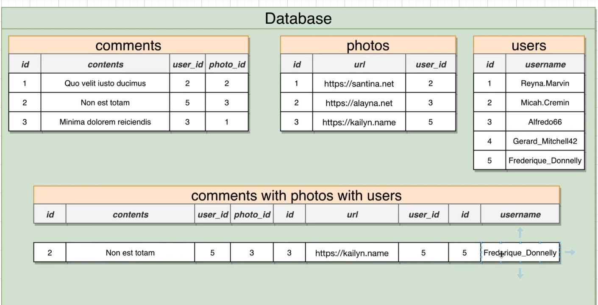
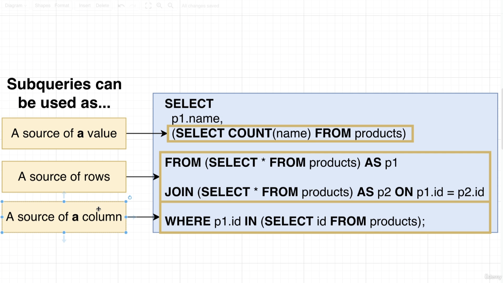

# SQL and PostgreSQL: The Complete Developer's Guide


### The largest cities example


#### Simple SQL Statements


```sql

# Create a table
CREATE TABLE cities(
  name VARCHAR(50),
  country VARCHAR(50),
  population INTEGER,
  area INTEGER
)

# Insert cities into a table
INSERT INTO cities (name, country, population, area)
VALUES
('Tokyo','Japan', 38505000, 8223),
('Delhi','India',28125000,2240),
('Shanghai','China',22125000,4015),
('Sao Paulo', 'Brazil', 20935000, 3043)

 
 # Query data from table
 SELECT name, population FROM cities;
 
 # Calculated Columns
 SELECT name, population / area AS density FROM cities;
 
 # String Operators and Functions
  
 # || Join Two Strings
 SELECT name || ', ' || country AS density FROM cities;
 
 CONCAT() Join Two Strings
 SELECT CONCAT(name,', ' ,country) AS location FROM cities;
 
 # UPPER()
 SELECT
   UPPER(CONCAT(name, ', ', country)) AS location
 FROM
   cities; 
   
 # LOWER()
 SELECT
   LOWER(CONCAT(name, ', ', country)) AS location
 FROM
   cities;
  
 # LENGTH() 
 SELECT
  LENGTH(CONCAT(name, ', ', country)) AS location
 FROM
  cities;
  
 #Query Result
 # location
 # 12
 # 12
 # 15
 # 17
 
```


#### Filtering Records

```sql

SELECT
  name,
  area
FROM
  cities
WHERE
  area > 4000

# BETWEEN
SELECT
  name,
  area
FROM
  cities
WHERE
  area BETWEEN 2000
  AND 4000;

# IN, NOT IN

SELECT
  name,
  area
FROM
  cities
WHERE
  NAME NOT IN ('Delhi', 'Shanghai')

# Combined Statement
SELECT
  name,
  area
FROM
  cities
WHERE
  area NOT IN (3043, 8223)
  OR name = 'Delhi'
  OR name = 'Tokyo'


# Calculations in "Where clauses"
SELECT
  name,
  area
FROM
  cities
WHERE
  population / area > 6000;
  

# Update
UPDATE
  cities
SET
  population = 39505000
WHERE
   name = 'Tokyo' AND country = 'Japan'
  
# Delete
DELETE FROM cities
WHERE name = 'Tokyo'
  
  
  
```


### User Photos and comments Example

```sql

# Create a users table
CREATE TABLE users (
  id SERIAL PRIMARY KEY,
  username VARCHAR(50)
);

INSERT INTO users (username)
VALUES
	('monahan93'),
  ('pferrer'),
  ('si93oins'),
  ('99stroman');

# Create a photos table
CREATE TABLE photos (
  id SERIAL PRIMARY KEY,
  url VARCHAR(200),
  user_id INTEGER REFERENCES users(id)
);


INSERT INTO photos (url, user_id)
VALUES
('http://one.jpg',4),
('http://2.jpg',1),
('http://3.jpg',2),
('http://4.jpg',1),
('http://5.jpg',3),
('http://6.jpg',3),
('http://7.jpg',4);


SELECT
  *
FROM
  photos
WHERE
  user_id = 3;

# Join statement

SELECT
  url,
  username
FROM
  photos
  JOIN users ON users.id = photos.user_id;

```


### Delete

```sql


# ON DELETE CASCADE
# Delete all realted data

CREATE TABLE photos (
id SERIAL PRIMARY KEY,
url VARCHAR(200),
user_id INTEGER REFERENCES users(id) ON DELETE CASCADE
);

INSERT INTO photos (url, user_id)
VALUES
  ('http:/one.jpg', 4),
  ('http:/two.jpg', 1),
  ('http:/25.jpg', 1),
  ('http:/36.jpg', 1),
  ('http:/754.jpg', 2),
  ('http:/35.jpg', 3),
  ('http:/256.jpg', 4);
    
   
# ON DELETE SET NULL
CREATE TABLE photos (
id SERIAL PRIMARY KEY,
url VARCHAR(200),
user_id INTEGER REFERENCES users(id) ON DELETE SET NULL
);
     
INSERT INTO photos (url, user_id)
VALUES
('http:/one.jpg', 4),
('http:/754.jpg', 2),
('http:/35.jpg', 3),
('http:/256.jpg', 4);
    

```


### Relating Records with Joins

```sql

SELECT
  contents,
  username
FROM
  comments
  JOIN users ON users.id = comments.user_id;
  
   
SELECT
  contents,
  url
FROM
  COMMENTS
  JOIN photos ON photos.id = comments.photo_id;

```


### Four kinds of Joins


 


```sql

SELECT
  contents,
  url
FROM
  COMMENTS
  JOIN photos ON photos.id = comments.photo_id
  WHERE comments.user_id = photos.user_id;
  
```


### Three way Join




```sql

SELECT
  contents,
  url,
  username
FROM
  COMMENTS
  JOIN photos ON photos.id = comments.photo_id
  JOIN users ON users.id = comments.user_id AND users.id = photos.user_id;
  
```


```sql


SELECT
title,
name,
rating
FROM
reviews
JOIN books ON books.id = reviews.book_id
JOIN authors ON authors.id = reviews.reviewer_id AND authors.id = books.author_id


# WRONG
SELECT
title,
name,
rating
FROM
reviews
JOIN books ON books.author_id = reviews.reviewer_id
JOIN authors ON authors.id = reviews.reviewer_id AND authors.id = books.author_id


```


### Aggregation of Records


```sql

# Query the number of comments created by users
SELECT user_id, COUNT(id) AS num_comments_created
FROM comments
GROUP BY user_id;

SELECT user_id, COUNT(*) 
FROM comments
GROUP BY user_id;


SELECT photo_id, COUNT(*)
FROM comments
GROUP BY photo_id;


# Query an author's name and the number of books they have authored

SELECT authors.name, COUNT(*)
FROM books
JOIN authors ON books.author_id = authors.id
GROUP BY authors.name;

# Query the number of comments for each photo, where the photo_id is less than 3 and the photo has more than 2 comments

# HAVING must be with GROUP BY

SELECT photo_id, COUNT(*)
FROM comments
WHERE photo_id < 3
GROUP BY photo_id
HAVING COUNT(*) > 2;

# Query the users(user_ids) where the user has commented on the first 50 photos and the user added more than 20 comments on those photos

SELECT user_id, COUNT(*)
FROM comments
WHERE photo_id < 50
GROUP BY user_id
HAVING COUNT(*) > 20;

# Query the names of manufacturers and total revenue  (price * units_sold) for all phones. Only print the manufacturers who have revenue greater than 2,000,000 for all the phones they sold.

SELECT manufacturer, SUM(price * units_sold)
FROM phones
GROUP BY manufacturer
HAVING SUM(price * units_sold) > 2000000


```


### Sorting Records

```sql

SELECT *
FROM products
ORDER BY price DESC;


SELECT *
FROM products
ORDER BY price, weight;


SELECT *
FROM products
ORDER BY price
LIMIT 20 OFFSET 40;

```


### Unions and Intersections with Sets


```sql


(
  SELECT *
  FROM products
  ORDER BY price DESC
  LIMIT 4
)
UNION
(
  SELECT *
  FROM products
  ORDER BY price / weight DESC
  LIMIT 4
);


(
  SELECT *
  FROM products
  ORDER BY price DESC
  LIMIT 4
)
INTERSECT
(
  SELECT *
  FROM products
  ORDER BY price / weight DESC
  LIMIT 4
);

(
  SELECT *
  FROM products
  ORDER BY price DESC
  LIMIT 4
)
EXCEPT
(
  SELECT *
  FROM products
  ORDER BY price / weight DESC
  LIMIT 4
);


```


### Assembling Queries with SubQueries


```sql


SELECT
  name,
  price
FROM
  products
WHERE
  price > (
    SELECT
      MAX(price)
    FROM
      products
    WHERE
      department = 'Toys'
  );
  
```




```sql

SELECT
  name,
  price,
  (
    SELECT
      price
    FROM
      products
    WHERE
      id = 3
  ) AS id_3_price
FROM
  products
WHERE
  price > 867;
  
# Result  
name	price	id_3_price
Practical Fresh Shirt	876	10
Incredible Granite Mouse	989	10
Generic Fresh Computer	926	10
Fantastic Metal Chair	887	10
Handcrafted Rubber Towels	945	10
Practical Rubber Mouse	948	10
Handmade Rubber Chicken	959	10
Awesome Fresh Keyboard	982	10
Incredible Granite Bacon	982	10
Licensed Steel Towels	939	10
Sleek Fresh Gloves	919	10


SELECT
name,
price,
price / (SELECT MAX(price) FROM phones) AS price_ratio
FROM
phones

# Result
name price price_ratio
N1280 199 0.4874
Iphone4 399 1
Galaxy S 299 0.7493


```


```sql

# Using a subquesry inside a FROM clause

SELECT name, price_weight_ratio
FROM (
  SELECT name, price / weight AS price_weight_ratio
  FROM products
) AS p 
WHERE price_weight_ratio > 5;


  SELECT name, price / weight AS price_weight_ratio
  FROM products 
  WHERE price / weight > 5


SELECT AVG(order_count)
FROM(
  SELECT user_id, COUNT(*) AS order_count
  FROM orders
  GROUP BY user_id
  ) AS p
  
# Query Result
avg
11.0000000000000000


SELECT MAX(average_price) AS max_average_price
FROM
 (SELECT AVG(price) AS average_price
 FROM
 phones
 GROUP BY manufacturer
 ) AS p
 
 # Query Result
 max_average_result
 399
 
 
 
 SELECT first_name FROM
  user 
  JOIN ( SELECT user_id FROM orders WHERE
      product_id = 3
  ) AS o ON o.user_id = users.id


SELECT 
first_name FROM
users
JOIN orders 
ON orders.user_id = users.id
WHERE orders.product_id = 3

 
SELECT id 
FROM orders 
WHERE product_id IN (
  SELECT id FROM products WHERE price / weight > 50
);


SELECT name, price
FROM products 
WHERE price > (
  SELECT AVG(price) FROM products 
);


SELECT name, price
FROM 
phones
WHERE
price > (
SELECT price 
FROM
phones
WHERE
phones.name == 'S5620 Monte'
)


```


